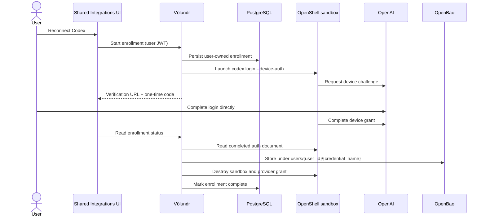

# Multi-user agent credential lifecycle

Status: Codex foundation implemented; deployment and live OpenShell validation pending.

## Decision

"Central" means one platform control plane for many users. It does **not** mean
one shared Codex or Claude identity.

Every interactive provider connection is owned by an authenticated user and is
addressed by:

```text
(tenant_id, user_id, provider_slug, connection_id, credential_name)
```

The connection and enrollment metadata live in PostgreSQL. Secret material lives
only in the user's OpenBao path. An administrator can inspect safe state metadata,
but cannot retrieve a token or complete login for another user.

## Codex flow

The shared Integrations settings surface starts a trusted, workspace-free
OpenShell sandbox. The sandbox runs `codex login --device-auth` with a temporary
`CODEX_HOME` configured for file-backed credential storage. It receives only the
network access required by the Codex binary; it receives no existing user
credential, repository, workspace, or host home directory.



OpenAI documents device-code authentication for headless Codex environments and
documents that `auth.json` contains sensitive access/refresh material. See
[Codex authentication](https://developers.openai.com/codex/auth/).

## Rotation and failure semantics

- Runtime sandboxes never receive the refresh token.
- OpenShell exchanges workload identity for a short-lived credential grant.
- Völundr refreshes the stored Codex access token before expiry and writes a
  rotated refresh token back to the same user's OpenBao document.
- Refresh is serialized with a PostgreSQL advisory lock keyed by
  `(owner_type, owner_id, credential_name)`, so separate Völundr replicas cannot
  spend the same rotating refresh token concurrently.
- An unrecoverable refresh sets safe metadata to `auth_required` with a stable
  error code. Provider error bodies and secret values are not persisted.
- Successful enrollment or refresh sets that credential back to `active`.

Ting treats a terminal session authentication error as a failed run. Restoring a
credential does not silently replay a failed workflow: the user retries the failed
run explicitly, which avoids duplicating external side effects. A later assisted
retry feature may list affected failed runs for the same user, but must keep the
final retry action explicit.

## Claude policy

Claude Code is not the same protocol as Codex:

- For multi-user product deployments, use a user-scoped Anthropic Console API
  key or an approved enterprise provider such as Bedrock, Vertex, or Foundry.
- Anthropic documents `claude setup-token` as a one-year, inference-only token
  for CI/scripts. If an operator elects to support it, store one token per user in
  OpenBao and expose it only through the OpenShell credential proxy; do not put it
  in Doppler or a static Kubernetes Secret.
- Do not offer a hosted Claude.ai subscription login on behalf of arbitrary
  platform users. Anthropic's current legal guidance says third-party developers
  must not route Free/Pro/Max plan credentials on users' behalf. See
  [Claude Code authentication](https://code.claude.com/docs/en/authentication) and
  [authentication and credential use](https://code.claude.com/docs/en/legal-and-compliance#authentication-and-credential-use).

Consequently, Codex device login is implemented as an interactive user connection;
Claude remains API-key/enterprise-provider based unless Anthropic supplies an
approved multi-user OAuth product contract.

## Security invariants

1. Enrollment authorization always uses the current end-user principal; admin
   role does not bypass enrollment ownership.
2. PostgreSQL stores challenge and lifecycle metadata only, never provider tokens.
   Terminal transitions erase the verification URI, user code, and runner reference.
3. OpenBao paths remain owner-scoped.
4. The enrollment sandbox has a 15-minute TTL, no workspace, no host home, and a
   temporary credential home. A server-side reconciliation loop destroys expired
   sandboxes and provider grants within the next 30-second pass even when the user
   closes the UI.
5. The UI receives only state, expiry, verification URI, and one-time user code.
6. Completion destroys the OpenShell sandbox and its network provider grant.
7. GitOps supplies configuration and deployment changes; no static secret
   manifests are introduced.

## Deployment acceptance

- Apply migration `000060_credential_enrollments` through the normal chart/Fleet
  rollout.
- Confirm the Codex catalog entry appears in shared Integrations for two different
  users.
- Complete login independently for both users using the same credential name and
  verify their OpenBao owner paths remain distinct.
- Force near-expiry token refresh from two Völundr replicas and verify only one
  provider refresh request occurs.
- Revoke one user's refresh token and verify only that user's connection becomes
  `auth_required` and only that user's workflow fails.
- Reconnect that user, explicitly retry the failed workflow, and verify the other
  user's connection and runs are unchanged.
