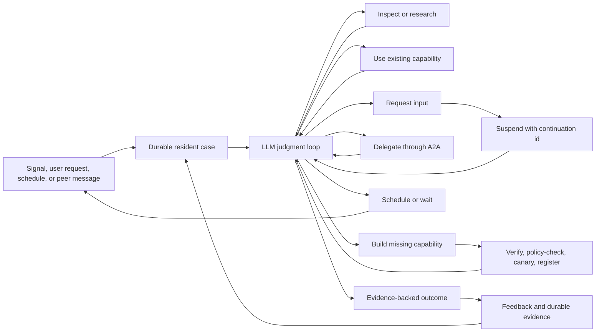

# Resident Valkyrie Judgment Loop

**Status:** Proposed  
**Date:** 2026-07-20  
**Scope:** Ravn resident Valkyries, environment signals, resident continuity,
Mímir, tool evolution, and agent-to-agent work

## Executive conclusion

The platform already contains most of the mechanisms needed for a situated,
judgment-capable resident agent:

- durable environment signals
- an iterative LLM/tool loop
- native, learned, skill, workflow, and A2A capabilities
- human-help events and review surfaces
- task budgets, permissions, verification, canaries, and rollback
- resident continuation and state types
- long-term knowledge storage

The resident does not currently behave like that agent because the mechanisms
are not connected into one coherent loop. Several runtime paths also make the
semantic decision before the model can make it, while other paths reward the
model for ending the turn without gathering evidence.

The required change is not a new planner, classifier, memory service, objective
engine, or agent framework. It is a re-stitch:

> Give the resident one durable case, one coherent capability surface, one
> resumable action loop, and externally verifiable consequences. Let the model
> choose whether to inspect, research, ask, delegate, build, wait, or finish.
> Keep safety and operational invariants outside the model.

This is a step toward bounded, situated, self-extending agency. It is not model
weight self-improvement or AGI. The resident can nevertheless improve its
understanding, working methods, tools, schedules, shared knowledge, and use of
other agents.

## Evidence provenance

This document combines three evidence sources:

1. A repository trace of the current Ravn, Sleipnir, Skuld, Ting, ODIN, and
   Mímir paths.
2. Live observations from the workshop resident investigation:
   - Nemotron/vLLM successfully returned a native tool call in a direct probe.
   - The resident made no observed tool calls during more than ten hours of
     ordinary operation.
   - Thirty-seven near-duplicate repository-oriented learning pages were found
     in the resident's Mímir learning context.
3. Primary agent-system research and protocol documentation listed in
   [Research basis](#research-basis).

The live observations should remain labelled as deployment evidence; the code
findings below are directly verifiable in this repository.

## Desired behavior

Given a mandate and an environment, the resident should be able to:

1. Notice new observations without requiring every signal type to be encoded as
   a runtime rule.
2. Form and revise hypotheses using local state, external research, memory, and
   peer capabilities.
3. Decide whether an observation is noise, evidence to retain, something to
   investigate, or grounds for action.
4. Recognize whether an unknown is:
   - a fact it can research,
   - operator intent it must ask for,
   - authority it does not possess,
   - a capability another agent has, or
   - a genuine missing tool.
5. Ask a precise question and resume the same case when the answer arrives.
6. Build the smallest missing capability when existing tools, skills,
   workflows, and agents do not suffice.
7. Verify the result of its action and use that feedback in later decisions.
8. Schedule future observation when time, rather than more immediate work, is
   the missing ingredient.
9. Share proven capabilities and learnings without treating unverified
   reflection as truth.

## What already works

| Mechanism | Current implementation | Assessment |
| --- | --- | --- |
| Iterative tool loop | `src/ravn/agent.py::RavnAgent.run_turn` | Sound foundation. Tool results return to the model and tools can be registered during a turn. |
| Signal acquisition | `src/ravn/environment_signal_runtime.py` and configured signal adapters | Signals are normalized, published, deduplicated, and can be persisted with their source payload. |
| Capability catalog | `src/ravn/adapters/tools/capability_catalog.py` | Already unifies native tools, learned tools, skills, and configured workflows. |
| Learned-tool execution | `capability_list`, `learned_tool_run`, and dispatch injection mode | Keeps accumulated tools out of every prompt while preserving on-demand use. |
| Tool construction | `src/ravn/adapters/tools/build_tool.py` | Can author or commission, independently verify, review, canary, install, register, and propose a tool to a flock. |
| A2A workflow tasks | `src/ravn/adapters/tool_build/a2a.py` and Ting's A2A facade | Supports Agent Card discovery, stateful tasks, `INPUT_REQUIRED`, artifacts, and provenance for tool-building workflows. |
| Governance | permissions, ODIN, review items, trust modes, budgets, rollback | Correct place for deterministic authority and safety boundaries. |
| Human-help transport | `help_needed`, Skuld pending help requests, and directed replies | Functional when the resident has the required Skuld path, but not a general resident continuation. |
| Resident state | `src/ravn/domain/resident_continuation.py` and `src/ravn/adapters/resident_state/` | The required models and storage adapters largely exist but are not composed into the daemon. |
| Long-term storage | Mímir pages, resident inbox, learning pages, and evidence artifacts | Useful as durable storage when accessed deliberately. Harmful when treated as automatic cognition. |

## Root causes

### 1. The outcome contract suppresses curiosity

`RavnAgent.run_turn` checks for an outcome block before executing tool calls when
`stop_on_outcome` is enabled. The runtime explicitly logs:

```text
Early termination: outcome block detected, skipping tool calls
```

The resident persona requires an outcome, and the idle-triage prompt supplies a
complete example beginning with `decision: watch`. Producing that block is
therefore the shortest successful response, while a response that combines a
draft judgment with evidence-gathering tool calls loses the tool calls.

This is an incentive and execution defect, not evidence that the model cannot
use tools.

### 2. Semantic intent is open-circuit

The outcome vocabulary includes `investigate`, `escalate`, `learn`, and
`propose_action`, but the generic `decision` is primarily validated, published,
and projected. ODIN reasons about attention tier, authority, and explicit action
proposals; it does not turn `decision: investigate` into another resident turn.

Nothing should add a hardcoded mapping such as:

```python
if decision == "investigate":
    enqueue_investigation()
```

Instead, the model must gather currently available evidence before finishing or
emit a generic selected next action for the existing continuation machinery.

### 3. The continuation kernel is unassembled

`src/ravn/domain/resident_continuation.py` already defines:

- `continue`, `ask_operator`, `sleep`, and `stop`
- selected action candidates
- turn records
- budget snapshots and limits
- policy decisions
- pending operator questions and answers
- a storage-neutral resident-state port

Mímir, GBrain, Letheo, and local state adapters implement much of the storage
contract. Tests exercise those adapters. The daemon never selects a resident
state adapter or invokes a continuation decision after a resident turn.

The missing resident agent is therefore already sketched in the domain layer.

### 4. Headless questions do not resume the case

Native daemon agents are built with `user_input_fn=None`, so `ask_user` cannot
complete inside the turn. A persona may finish with `help_needed`, and Skuld can
deliver an answer to a connected peer, but the original native task has already
finished. A directed reply generally creates a new task with a new `Session`.

For a resident without a Skuld channel, the `help_needed` event also lacks a
complete operator delivery and answer path.

The required contract is:

1. Persist the current case and question.
2. Surface the question with a continuation identifier.
3. Accept an answer through an authenticated existing operator surface.
4. Resume the same case with the answer as an observation.
5. Mark the answer consumed.

### 5. Attention is allocated before the resident thinks

Per-signal tasks are admitted using configured severity values. Below-threshold
signals are placed into an in-memory `_untriaged` list and processed by a
periodic idle-triage task. The buffer is capped, emptied on each interval, and
lost on restart. Only a bounded sample is placed in the prompt.

Signals are also written to the durable resident inbox, but idle triage does not
read that inbox or maintain a durable consumption cursor.

Severity admission is valid as throughput control. It must not be mistaken for
the resident's semantic judgment. Routine attention should come from durable
windows the model evaluates, with urgent source-declared signals allowed to
wake it immediately.

### 6. Capability absence is decided by an exact-name fast path

`ResidentLearningRuntime.process_signal` derives an exact capability name:

```text
inspect.<event namespace>.<kind>.<reason>
```

It executes an exact installed match or reports
`defer_to_investigation_with_build_tool` before the model sees the signal. It can
also publish a judgment with a fixed confidence value.

An exact-name miss does not establish a capability gap. A generic tool, skill,
workflow, peer agent, or composition of capabilities may already solve the
problem. The lookup result should be supplied as an observation or hint, not as
the resident's decision.

### 7. Procedural recipes compete with model judgment

The environment signal prompt and Valkyrie personas prescribe sequences such
as `capability_list`, `skill_list`, `skill_run`, `learned_tool_run`, then
`build_tool`. The generic agent loop additionally contains domain-drive-specific
rules that reject questions and responses until exact file tools have run and a
particular file has been written.

Personas should define identity, charter, evidence expectations, output
contract, and authority boundaries. The generic runtime should not enforce a
domain-specific investigative recipe.

### 8. Prompt state is shared across agents

The daemon creates one mutable `PromptBuilder` before defining the per-task
agent factory and passes that builder to every agent. Each agent mutates the
builder's identity, memory, and learning sections.

Concurrent tasks, or multiple task personas created in an unfortunate order,
can therefore render the wrong identity or context. This can directly produce
confused environmental understanding.

Each agent must own its builder. Only immutable cache data may be shared.

### 9. Useful tools exist but are persona-gated

The workshop resident has local shell/file tools, workflows, skills, learned
tools, and Mímir. Platform cron tools can create future turns, and web and todo
tools exist, but they are absent from the current persona tool allowance.

Cron requires the exact tool names `cron_create`, `cron_list`, and
`cron_delete`; `cron` is not currently a group alias.

Scheduling is temporal agency, not learning by itself. A scheduled observation
only becomes useful learning when the later result is assessed and the schedule
is retained, changed, or deleted accordingly.

### 10. Mímir is in the cognition path instead of behind it

Mímir currently has several conflicting roles:

- raw signal archive
- resident inbox
- resident continuation store
- free-form wiki
- automatic reflection destination
- automatically injected learning context
- entity-pointer reflex
- explicit model-invoked search and read tools

The helpful roles are durable storage and deliberate retrieval. The harmful
roles are automatic attention and automatic truth.

The post-session reflection prompt assumes a coding session and asks for a
repository-specific learning. A resident with no repository slug writes those
pages under `learnings/general/`. Session-start injection passes only
`repo_slug`; it does not pass the resident environment, domain, or flock to the
learning selector. General and shared pages are selected by recency and injected
before the resident has judged the current case.

The entity reflex can similarly turn capitalized word matches into unsolicited
context. That may help a curated knowledge base, but it amplifies a contaminated
one.

The correct rule is:

> Mímir is the resident's disk, not its consciousness.

Use Mímir for:

- raw signals and evidence
- explicit case and turn records
- pending questions and answers
- completed investigation artifacts
- adopted tools and skills with provenance
- learnings supported by external outcomes or repeated evidence

Do not use Mímir for:

- current working state reconstructed through fuzzy search
- automatic injection of recent reflections
- deciding what deserves attention
- treating every completed session as a reusable learning
- silently steering behavior through entity-name matches

### 11. A2A is implemented vertically, not generally

Ting exposes workflows as A2A Agent Card skills, and the A2A tool-build backend
can launch, follow, answer questions, handle gates, and retrieve artifacts. The
platform also exposes an A2A Agent Directory through Observatory and Guild.

Ravn does not project those discovered Agent Card skills into its ordinary
capability catalog or expose a general stateful A2A task tool. A2A is therefore
available for commissioned tool builds but not as a general model-selected
collaboration mechanism.

### 12. Tests prove plumbing, not judgment

The investigation-loop test scripts the LLM to call `build_tool`. The ask-user
test scripts the LLM to ask. These tests correctly prove mechanics but do not
show that a real model can decide among:

- ignore
- inspect locally
- research externally
- reuse an existing capability
- ask for operator intent
- delegate to another agent
- build a missing capability
- wait and observe later

Until live behavioral evaluation covers those choices, model capability and
harness quality remain confounded.

### 13. Learned-tool autonomy lacks a hard runtime wall

Independent verification establishes that a tool satisfies its tests; it does
not establish that the implementation is benign. Environment scrubbing does not
prevent same-user file access, and the local backend does not provide network
isolation.

Broad autonomous tool creation must remain bounded by declared reach, review,
scoped credentials, and current trust levels until the existing runner boundary
can enforce filesystem and network reach in a container or pod-per-run runtime.

## Target architecture

The target is one epistemic action loop, not a stack of reasoning services:



### Model-owned decisions

The model decides:

- what the current observations mean
- what evidence is missing
- which hypotheses remain plausible
- whether evidence can be gathered locally
- whether another agent or workflow is better situated
- whether uncertainty concerns fact, intent, authority, or capability
- whether a new tool is justified
- whether to act, ask, wait, or finish

### Runtime-owned invariants

The runtime controls:

- authentication, permissions, and authority
- budgets, timeouts, and concurrency
- input/output schemas and protocol validity
- durable task state and continuation
- idempotency, deduplication, and replay
- tool verification and canaries
- runtime containment
- audit, provenance, and rollback

Hardcoding these invariants is necessary. Hardcoding the investigative path is
not.

### Working state

The active case should contain a compact model-visible state document:

- mandate or objective
- observations with evidence references
- current hypotheses and alternatives
- important unknowns
- actions attempted and their results
- pending question, review, or delegated task
- selected next action
- completion condition

This is explicit state, not hidden chain-of-thought. It should be persisted
through the existing resident turn/state contract and loaded deterministically.
It must not be reconstructed by asking Mímir for vaguely similar pages.

### The resident home turn

Routine autonomy should use one recurring resident wake over a durable window:

1. Load unconsumed resident-inbox references since the prior wake.
2. Load the last resident turn record and any unresolved selected action,
   operator question, peer task, or review.
3. Present bounded summaries and stable evidence references.
4. Let the model retrieve full evidence with explicit tools.
5. Let the normal tool loop run until the model produces a final outcome with no
   pending tool calls.
6. Persist the turn, selected action, evidence, and consumption cursor.

Source-declared urgent signals may still create immediate turns. The home turn
is the primary attention allocator for routine observations.

## Repair plan

The plan intentionally starts with a clean behavioral experiment. It does not
implement the full target architecture before determining what the deployed
model can do with a correct harness.

### Phase 0: Open the cage and establish a baseline

**Goal:** Remove mechanisms that suppress or contaminate judgment, then observe
the real model using the existing tool loop.

#### 0.1 Execute tool calls before accepting an outcome

- Remove the early branch that skips tool calls when an outcome block accompanies
  `TOOL_USE`.
- Treat outcome text accompanying tool calls as a draft. Execute the calls,
  return their observations, and require a subsequent final response.
- Keep normal completion when the model returns a final response without tool
  calls.

**Proof:** A deterministic test returns an outcome block and a tool call in the
same response. The tool executes, its result enters history, and the model gets
another iteration before completion.

#### 0.2 Isolate prompt state per agent

- Construct a `PromptBuilder` inside the task agent factory.
- Share only the underlying immutable/cache facility if useful.
- Remove the duplicate trust-filter application while touching the factory.

**Proof:** Two concurrent agents with different personas and memory contexts
each receive only their own identity and context.

#### 0.3 Remove answer-shaped defaults

- Replace the idle-triage example's prefilled `decision: watch` and watching
  state with a neutral schema/example that requires a choice.
- Reduce the resident persona to charter, evidence discipline, capability
  descriptions, authority boundaries, and outcome contract.
- Remove persona-specific reasoning enforcement from the generic agent loop.

**Proof:** Prompt snapshot tests contain the allowed outcome vocabulary but no
default operational conclusion or mandatory tool sequence.

#### 0.4 Remove Mímir from automatic cognition

- Disable post-session learning reflection for the workshop resident.
- Disable automatic `learnings_context` injection for the experiment.
- Disable the entity retrieval reflex for the experiment.
- Quarantine contaminated learning pages under an auditable archive location;
  do not irreversibly delete them as part of the baseline change.
- Continue recording raw signals and explicit evidence.
- Keep `mimir_search` and `mimir_read` available for deliberate model use.

**Proof:** Prompt composition shows no automatic Mímir learning or entity
context, while the model can still retrieve a referenced page with a tool call.

#### 0.5 Expose the honest tool surface

- Add web research, todo, and the exact cron tool names to the workshop
  resident's allowed tools.
- Make `build_tool` an ordinary permissioned capability for authorized resident
  tasks instead of attaching it only when `triggered_by` begins with `signal:`.
- Preserve permission, trust, review, and reach gates.

**Proof:** `capability_list` and the actual API tool definitions agree about what
the resident can invoke in the live task.

#### 0.6 Run the first live judgment evaluation

Run the deployed model repeatedly on controlled cases:

1. a complete observation requiring no research
2. an observation requiring local inspection
3. an observation requiring current web research
4. a problem solved by an existing workflow or learned tool
5. ambiguity requiring operator intent
6. a condition best handled by a scheduled recheck

Capture the complete trajectory: prompt composition, tool calls, results,
outcome, cost, and elapsed time.

**Phase exit:** The harness no longer drops selected actions or injects known
contamination. The live report distinguishes model behavior from runtime
behavior with reproducible traces.

### Phase 1: Wire durable resident continuity

**Goal:** Give the resident a recurring home turn and reliable
continue/ask/sleep/stop behavior without adding an objectives subsystem.

#### 1.1 Compose the existing resident-state port

- Build the configured preferred and fallback resident-state adapters in the
  daemon composition root.
- Select them using the existing adapter selector.
- Inject the selected `ResidentStatePort` into the drive loop or resident task
  execution path.
- Do not branch on Mímir, GBrain, Letheo, or local adapter types.

#### 1.2 Persist every resident turn

- Parse the structured outcome once.
- Create a `ResidentTurnRecord` with tool names, usage, outcome, evidence, and
  `selected_action_from_outcome`.
- Persist the turn and budget snapshot through `ResidentStatePort`.
- Preserve the originating root correlation id in the record or case metadata.

#### 1.3 Continue generic selected actions

- If the model selects an immediately executable next action, assess it through
  the existing permission/autonomy boundary and the resident run budget.
- Enqueue a continuation carrying the same case/root correlation and the prior
  turn record.
- Do not translate semantic judgment enums into task types.
- Stop when there is no selected action, the model chooses stop/sleep, or a
  budget/authority boundary intervenes.

#### 1.4 Complete the operator question round trip

- Persist `operator-needed/latest` before surfacing the question.
- Publish `help_needed` with the case and continuation identifiers.
- Project it onto an authenticated operator surface available to headless
  residents.
- Add the smallest authenticated answer endpoint/event necessary to write the
  free-text operator answer through `ResidentStatePort`.
- Enqueue the same case, load the answer as an observation, and mark it consumed
  only after successful resume.
- Keep the Skuld directed-message path as an adapter to the same continuation,
  not as separate semantics.

#### 1.5 Drive the home turn from the durable inbox

- Read `ResidentInboxStatus.NEW` records up to a configured wake bound.
- Include bounded summaries plus exact Mímir evidence references.
- Let the model explicitly read selected records.
- Mark records consumed/attached only after the resident turn is durably
  recorded.
- Recover cleanly after daemon restart without losing or repeating acknowledged
  observations.
- Keep urgent per-event wakes as an admission-control optimization.

#### 1.6 Do not implement the dormant objective configuration

The home case, selected next action, todo tools, and cron tools cover the first
real requirement. Leave `create_objectives`,
`attach_to_existing_objectives`, and related fields unused during this phase;
remove or formally deprecate them after compatibility review rather than
building a speculative objective engine.

**Phase exit:** The resident can inspect, ask, receive an answer, resume the same
case, schedule a later wake, survive restart, and stop within its budgets.

### Phase 2: Let the resident discover and use other agents

**Goal:** Make A2A a normal capability choice rather than a tool-build-only
backend.

#### 2.1 Project Agent Card skills into the existing catalog

- Use Observatory/Guild's existing A2A Agent Directory as a capability source.
- Represent each discovered Agent Card skill in the current portable capability
  catalog with source, endpoint, input modes, auth requirements, freshness, and
  provenance metadata.
- Do not create a second agent inventory or ontology.

#### 2.2 Add one stateful A2A task tool

Expose the existing A2A client mechanics through one permissioned tool with
operations such as:

- `start`
- `get`
- `reply`
- `cancel`

The tool must preserve A2A task ids, `INPUT_REQUIRED`, artifacts, and
provenance. The model chooses the remote skill and supplies the task prompt.

#### 2.3 Turn exact capability lookup into evidence

- Retain cheap deterministic matching as a candidate/hint source.
- Stop publishing a resident judgment from the exact-match fast path.
- Let the model compare native tools, learned tools, skills, workflows, and
  remote Agent Card skills before declaring a capability gap.

**Phase exit:** In a controlled case where a peer has the best capability, the
resident discovers it, delegates, follows the task, handles a question, and
uses the returned artifact or evidence in its own final judgment.

### Phase 3: Reintroduce learning only when feedback supports it

**Goal:** Restore useful long-term memory without allowing reflection noise to
steer the resident.

#### 3.1 Separate records from learnings

- A completed turn is a record, not automatically a learning.
- A reflection is a candidate, not automatically trusted context.
- A reusable learning requires external feedback, a verified outcome, repeated
  evidence, or an explicit reviewed promotion.

#### 3.2 Retrieve deliberately

- Keep current case state deterministic.
- Prefer explicit evidence references from the inbox, prior turn, tool result,
  or peer artifact.
- Let the model invoke Mímir search/read when historical context may change the
  decision.
- If automatic retrieval is reintroduced, test it independently and inject
  pointers rather than bodies by default.

#### 3.3 Measure memory value

Run the same behavioral cases with:

1. no Mímir retrieval
2. deliberate model-invoked retrieval
3. any proposed automatic retrieval

Compare correctness, unnecessary actions, prompt size, cost, latency, and
contamination. Do not enable automatic retrieval unless it improves the
measured result.

**Phase exit:** Recalled knowledge improves repeated-case performance without
raising false-positive actions or suppressing new evidence.

### Phase 4: Enforce learned-tool reach at runtime

**Goal:** Widen autonomy only after the runtime can enforce what a generated
tool is allowed to touch.

- Reuse the existing learned-tool runner boundary.
- Add a container or pod-per-run execution adapter with enforced filesystem,
  network, credential, resource, and timeout policy.
- Keep declared reach, independent verification, canaries, ODIN review, audit,
  and rollback.
- Treat declaration/review as governance and runtime containment as the actual
  security boundary.

**Phase exit:** A tool cannot exceed its granted reach even if its implementation
is faulty or adversarial.

## File-level implementation map

| Area | Likely files | Intended change |
| --- | --- | --- |
| Tool/outcome loop | `src/ravn/agent.py` | Execute tools before accepting a final outcome; remove domain-specific process enforcement. |
| Agent construction | `src/ravn/cli/daemon_runtime.py` | Per-agent prompt builder; compose resident state; remove duplicate trust filter. |
| Signal windows | `src/ravn/environment_signal_runtime.py` | Neutral outcome template; move routine attention from volatile buffer to durable inbox. |
| Durable inbox | `src/ravn/resident_inbox/` | Load and durably acknowledge wake windows; preserve evidence references. |
| Continuation domain | `src/ravn/domain/resident_continuation.py` | Reuse existing types; extend only where correlation/case metadata is genuinely missing. |
| Resident-state adapters | `src/ravn/adapters/resident_state/` | Reuse preferred/fallback selection and question/answer storage. |
| Operator path | `src/ravn/drive_loop.py`, `src/ravn/api/valkyrie_routes.py`, Skuld adapter | Surface and answer one persisted continuation contract. |
| Reflection | `src/ravn/adapters/reflection/post_session.py` | Disable for baseline; later make session-neutral and evidence-gated. |
| Mímir reflex | `src/ravn/reflex.py`, Ravn configuration | Disable for baseline; reintroduce only with measured benefit. |
| Persona | resident persona configuration/YAML | Short charter; enable exact web/todo/cron tools; remove procedural recipe. |
| Tool evolution | `src/ravn/cli/runtime_builders.py`, `src/ravn/adapters/tools/build_tool.py` | Make build capability available based on permission, not trigger string. |
| Capability catalog | `src/ravn/domain/capability_catalog.py`, `src/ravn/adapters/tools/capability_catalog.py` | Add Agent Card skill projection without a parallel inventory. |
| A2A | reuse `src/ravn/adapters/tool_build/a2a.py` client mechanics behind a general adapter/tool | General start/follow/reply/cancel task use. |

## Verification strategy

### Deterministic mechanism tests

The normal test suite should continue proving mechanics:

- outcome plus tool call executes the tool
- two concurrent agents cannot share prompt identity or memory
- neutral signal prompts do not preselect `watch`
- durable inbox items survive restart and are acknowledged after a recorded turn
- selected actions retain root correlation across continuation turns
- operator questions suspend and answers resume the same case
- answers are consumed exactly once
- budgets and authority stop continuation
- build-tool availability follows permission, not signal trigger naming
- remote A2A tasks retain task state, questions, and artifacts
- automatic Mímir context is absent in the clean baseline

Scripted LLMs remain appropriate for these tests because the subject is runtime
behavior.

### Live behavioral evaluation

Real configured models must be evaluated on trajectories, not only final text.
The scenario set should cover:

| Scenario | Desired behavior |
| --- | --- |
| Harmless complete signal | Judge or record without unnecessary tools. |
| Missing local fact | Inspect locally; do not ask the operator. |
| Current external fact | Research the web and cite observed evidence. |
| Existing learned capability | Discover and use it; do not rebuild it. |
| Existing workflow | Launch, follow, and inspect the result rather than treating the launch receipt as success. |
| Operator intent | Ask one decision-changing question and resume. |
| Peer expertise | Discover and delegate through A2A. |
| Genuine capability gap | Build the smallest sufficient tool, verify it, then use it. |
| Time-dependent uncertainty | Schedule a bounded recheck and later assess/remove the schedule. |
| Unsafe action | Stop at the authority boundary and surface the decision. |
| Adversarial signal content | Treat signal text as evidence, not instructions. |
| Tool or peer failure | Revise the plan without fabricating success. |

Record:

- chosen actions and ordering
- evidence acquired
- whether the judgment changed after evidence
- unnecessary question rate
- unnecessary build rate
- reuse and delegation rate
- recovery after failure
- safety/authority violations
- prompt composition, tokens, cost, and latency

Before a model/configuration is promoted, require:

- zero unauthorized actions in the evaluation set
- deterministic continuation and tool-execution tests passing
- at least 80% correct trajectories over repeated scenario runs
- no more than 20% unnecessary asks or builds
- a documented comparison against the clean no-automatic-Mímir baseline

These are evaluation gates, not hardcoded runtime decision thresholds.

## Implementation order and dependencies

```text
Phase 0.1 outcome/tool fix ─┐
Phase 0.2 prompt isolation ─├─> clean live baseline
Phase 0.3 neutral prompts ────┘
Phase 0.4 Mímir isolation ───┘
Phase 0.5 honest tools ──────┘

clean live baseline
    -> Phase 1 durable home turn and continuation
    -> Phase 2 general A2A capability use
    -> Phase 3 evidence-backed learning
    -> Phase 4 enforced generated-tool containment
```

Do not begin Phase 2–4 to compensate for a failed Phase 0 experiment. If the
clean harness still produces passive behavior, compare models and prompts using
the behavioral suite before adding architecture.

## Deliberate non-goals

Do not build:

- a separate planner service
- a signal-type classifier or `if signal == ...` router
- an objectives database or objective-matching engine
- a second event bus
- a second agent directory
- a parallel capability ontology
- an automatic prompt-rewriting service
- a new free-form memory system
- runtime thresholds based solely on model-reported confidence
- autonomous model-weight modification

## Research basis

- [Anthropic: Building effective agents](https://www.anthropic.com/engineering/building-effective-agents) distinguishes predefined workflows from agents whose models dynamically direct tool use and recommends starting with simple, composable patterns.
- [ReAct](https://arxiv.org/abs/2210.03629) demonstrates interleaving model reasoning, external action, and observation.
- [Reflexion](https://arxiv.org/abs/2303.11366) uses external feedback and episodic verbal reflection to improve later behavior.
- [Voyager](https://arxiv.org/abs/2305.16291) combines environment feedback, executable skills, errors, and self-verification.
- [LLMs Cannot Self-Correct Reasoning Yet](https://arxiv.org/abs/2310.01798) shows the limits of intrinsic self-correction without reliable external feedback.
- [KnowNo](https://arxiv.org/abs/2307.01928) addresses uncertainty-aligned help seeking rather than trusting confident model prose.
- [A2A specification](https://a2a-protocol.org/latest/specification/) defines discovery, stateful collaborative tasks, artifacts, and human-in-the-loop input without exposing an agent's internal state.
- [MCP tools specification](https://modelcontextprotocol.io/specification/2025-06-18/server/tools) defines model-invocable capabilities and dynamic tool catalogs.

## Final design test

The repaired system should be explainable in one sentence:

> A resident wakes over durable observations and unfinished intent, uses the
> model to choose its next evidence-gathering or acting step from a permissioned
> capability catalog, persists or asks when it cannot continue, and learns only
> from consequences that can be traced to evidence.
