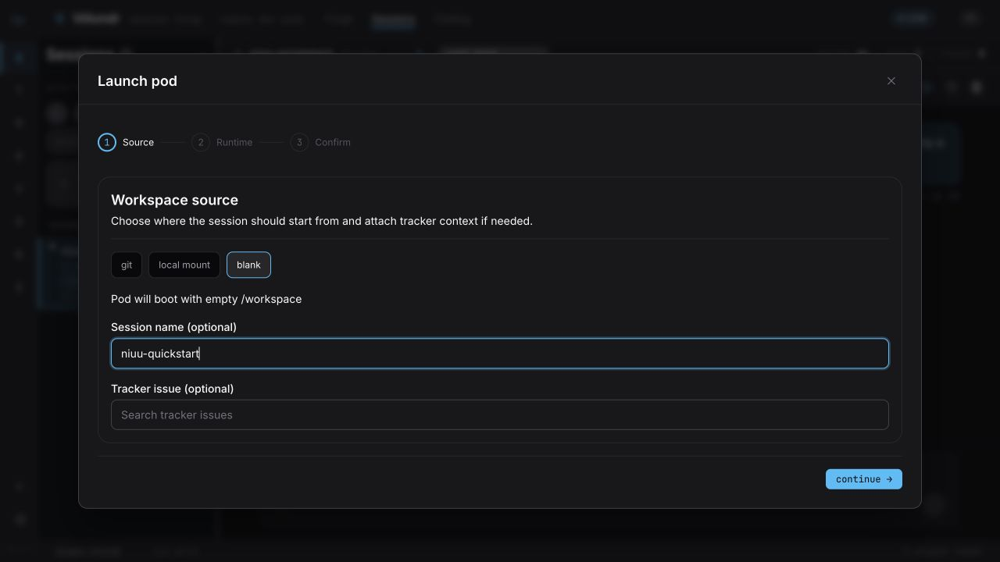
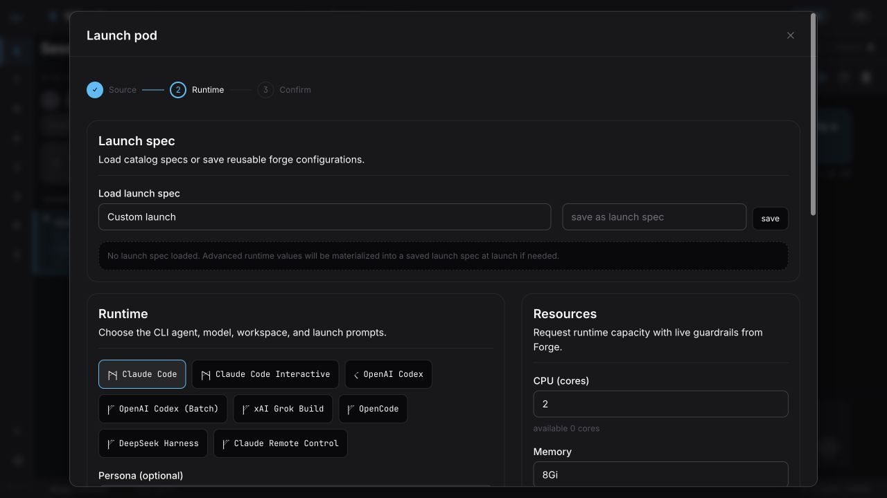
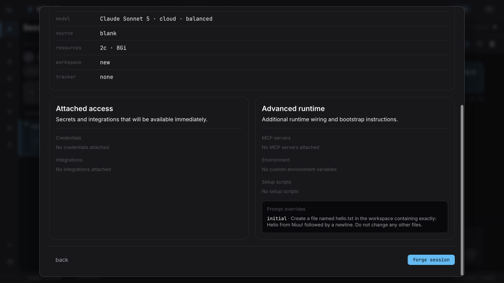

# Quick start: your first working session

Run Niuu locally, launch Claude Code in an empty workspace, and have it create a
file you can inspect. You do not need a repository, a saved launch spec, a
Kubernetes cluster, or a model gateway for this exercise.

This guide uses **mini mode**: Niuu and the session run as local processes under
your OS user. A workspace is the directory containing the agent's files; a
session is the running agent and its conversation. Stopping a session leaves its
workspace on disk.

## 1. Install the two tools

You need:

- **Niuu** for the platform and browser interface. Follow [Install Niuu](install.md)
  for macOS Apple Silicon, Linux x86-64, or Linux ARM64, then return here.
- **Claude Code** and a working Claude subscription login for the agent in this
  tutorial. Follow [Anthropic's installation instructions](https://code.claude.com/docs/en/quickstart#step-1-install-claude-code).
- **Git** on `PATH`, required by Niuu's local preflight even for this empty workspace.

Use an ordinary user account, not root: embedded PostgreSQL cannot initialize as
root. Keep the default loopback address for this personal local setup.

In your terminal, verify the executables:

<!-- quickstart-check: version -->
```bash
niuu --version
claude --version
git --version
```

Each command must print a version. If one says `command not found`, finish that
installation before proceeding. On macOS, `xcode-select --install` installs the
Command Line Tools if Git reports they are missing.

## 2. Prove the agent can authenticate

Run this in the **same OS account** that will start Niuu:

```bash
claude auth login
```

Complete the browser login, then send one small request:

<!-- quickstart-check: authenticate -->
```bash
claude -p 'Reply with exactly OK.' --model sonnet --max-turns 1
```

Proceed only when it exits successfully and answers `OK`. This uses your Claude
account's allowance. `claude auth status` alone is insufficient: a stored login
can exist while its token has expired.

The local Claude Code runtime uses the same account's subscription credentials.
Leave Niuu's **Access** selections empty for this exercise; you do not have to
create a Niuu credential or connect an integration. An API key alone does not
select API-key billing: see [Claude authentication](../reference/credentials-and-secrets.md)
for that separate setup. Host login does not automatically authenticate an
OpenShell or Kubernetes sandbox.

## 3. Initialize and start Niuu

<!-- quickstart-check: init -->
```bash
niuu platform init
```

At `Choice`, press **Enter** to choose **mini**, the default. This writes
`~/.niuu/config.yaml`. If the file already exists, Niuu asks before overwriting
it; keep an existing setup unless you intend to replace its configuration.

<!-- quickstart-check: start -->
```bash
niuu platform up
```

Keep this terminal open. Startup runs preflight checks, starts embedded
PostgreSQL, and prints `Ready! Platform running on ...` with the browser URL.
The default is `http://127.0.0.1:8080/`.

In a **second terminal**, check the running host:

<!-- quickstart-check: health -->
```bash
curl --fail "${NIUU_QUICKSTART_URL:-http://127.0.0.1:8080}/health"
```

Expect `{"status":"ok"}`. `NIUU_QUICKSTART_URL` is optional; set it to the
printed base URL if you changed the host or port. A bind address of `0.0.0.0`
means all interfaces: use `127.0.0.1` to open it on the same machine.

## 4. Launch an empty workspace

Open the printed browser URL. Select **Völundr → Forge** if you are elsewhere.
Under **Quick launch**, click **custom launch…**. Alternatively, open
**Sessions** and click the **+** button titled **Launch a new session**.

The dialog is currently called **Launch pod**, including in local mode. In this
exercise it starts a local process, not a Kubernetes pod.

### Source

1. Select **blank**. Leave repository and tracker setup for later.
2. Enter `niuu-quickstart` in **Session name (optional)**.
3. Click **continue →**.



### Runtime

Use these values:

| Field | What to choose | Why |
| --- | --- | --- |
| Load launch spec | **Custom launch** | No reusable configuration is needed yet. |
| Runtime | **Claude Code** | Uses the local subscription login verified above. |
| Persona | **No persona** | No additional persona instructions for this exercise. |
| Model | The **Claude Sonnet** entry | Use the Sonnet version offered by your installed release. |
| Forge | **Specific Forge → Local Forge** | Run on this machine. |
| CPU / Memory / GPU | Leave the defaults | Mini mode runs local processes; these fields are not a local sandbox or resource-isolation guarantee. |
| Credentials / Integrations | Leave empty | The local Claude subscription login is already available. |
| Advanced | Leave unchanged | No MCP server, setup script, or environment override is needed. |



Paste this into **Initial prompt (optional)**:

<!-- quickstart-check: prompt -->
```text
Create a file named hello.txt in the workspace containing exactly: Hello from Niuu! followed by a newline. Do not change any other files.
```

Click **continue →**. On **Confirm**, check the session name, **Claude Code**,
**Local Forge**, the Sonnet model, and **source blank**, then click
**forge session**. When **open pod →** becomes available, click it.



The boot screen uses generic labels such as image pulls and PVC attachment.
For this local exercise, those labels do not mean a cluster is involved. A
running session only proves the runtime started; the next step proves the agent
can do work.

## 5. Verify the result

In **Chat**, wait for the agent's reply. If it requests approval to create the
file, review the requested path and approve that action. If it reports an
authentication or model error, use the troubleshooting table below.

Open **Files**, select `hello.txt`, and confirm its contents:

```text
Hello from Niuu!
```

You can also check the file from the second terminal. Copy the session ID using
the copy button next to the session name, then paste it at the prompt:

```bash
printf 'Session ID: '
read -r SESSION_ID
cat "$HOME/.niuu/workspaces/$SESSION_ID/hello.txt"
```

If you configured a different workspace directory,
use that directory instead. For an exact newline check:

```bash
printf 'Hello from Niuu!\n' | cmp - "$HOME/.niuu/workspaces/$SESSION_ID/hello.txt"
```

`cmp` prints nothing and exits successfully when the bytes match. This is an
empty workspace, not a Git repository: **Diffs** is not the acceptance check for
this exercise. The file itself is.

## 6. Stop the session and platform

Click **Stop session** in the session toolbar. Check that its status becomes
**stopped**. Run `cat` again from the second terminal: the file should still be
there. Stopping ends the running session; it does not delete your workspace.

In the terminal running `niuu platform up`, press **Ctrl+C**. Wait for shutdown
messages and the shell prompt to return. A subsequent `/health` request should
fail to connect.

Do not use a second `niuu platform down` process to stop this foreground host.
Currently `down` and `status` operate on their own process-local service manager;
`status` is not a health probe of the host you started in another terminal.

## If something fails

| Symptom | What to check next |
| --- | --- |
| Preflight cannot find `claude` | Run `claude --version` in the terminal that starts Niuu; fix its `PATH`. |
| Embedded PostgreSQL binaries are missing | For a source checkout, run `make build-postgres`. For a release installation, reinstall the matching release asset and report the version if its bundle is incomplete. |
| Port 8080 is already in use | Stop the other local host or set `server.port` in `~/.niuu/config.yaml`, restart, and use the newly printed URL. |
| `forge session` is disabled | Check that a model is selected and the source is blank. Resolve any resource or Forge-target validation message. |
| Session runs but Chat reports expired OAuth / 401 | Stop the session, run `claude auth login`, and repeat the real `claude -p` check. Launch a new session after authentication succeeds. |
| Model unavailable or access denied | Check the model in the launch summary and test access with the Claude CLI. A catalog entry does not grant provider access. |
| `hello.txt` is missing | Inspect Chat for tool approvals/errors and **Logs** for runtime failures. Do not treat the running status or the boot progress bar as proof of inference. |
| Connection buttons in Settings do not work locally | Browser-based provider enrollment needs a configured login runner. This tutorial uses the host's Claude login instead. |

## Next

You have now exercised platform startup, agent authentication, session launch,
a file-writing tool call, result inspection, and shutdown. Next, [use a repository
and save a reusable launch](configure-project.md). Add Bifröst, workflows, and
residents after this basic path works.

For the automated checks and their limits, see [Quick-start verification](../operations/quickstart-verification.md).
