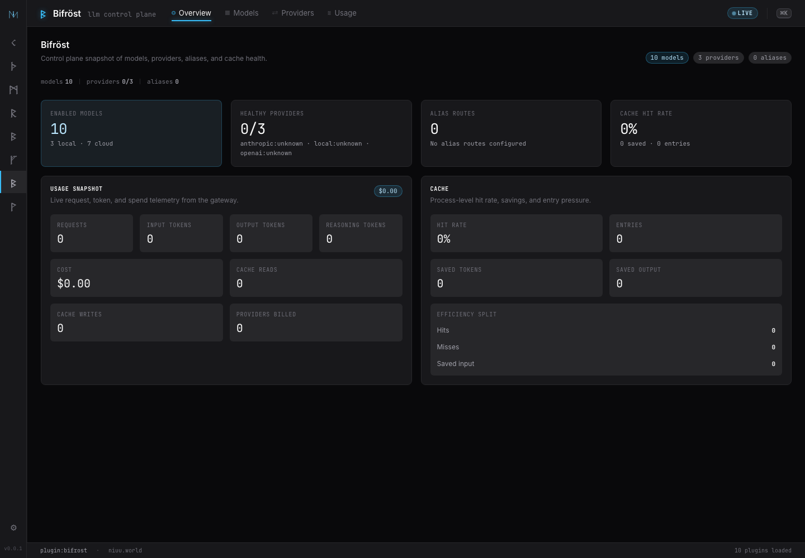

# Model Routing

Add model routing when you want Niuu to choose between local and cloud models in
a predictable way.

This is where Bifröst becomes useful. Treat it as the model control plane, not
as another thing to learn on day one.

## Why add this step

Without routing, every session or assistant can drift into its own model
configuration. That becomes hard to reason about once you have several
workspaces, providers, or cost policies.

Model routing gives you:

- provider health checks
- aliases such as `fast`, `balanced`, or `best`
- local and cloud provider choices
- usage visibility
- one place to change model policy

## Start with intent

Decide what you want before changing config:

| Intent | Typical choice |
| --- | --- |
| Keep work local | Ollama or another local OpenAI-compatible provider |
| Use strongest hosted models | Cloud provider with explicit credentials |
| Mix local and cloud | Local fallback or cloud fallback strategy |
| Control cost | Aliases with cheaper defaults |
| Improve reliability | Failover routing |

## Configure providers

Use the platform settings or service configuration to define providers and
aliases. Keep secrets in the configured credential system, not in docs, shell
history, or committed config.

For local source development, the setup examples under
`scripts/setups/configs/` show useful Bifröst shapes:

- `bifrost-ollama`
- `bifrost-cloud`
- `bifrost-hybrid`

Treat those as examples, then adapt them to your environment.

## Use aliases from sessions

Once aliases exist, launch sessions by selecting the alias instead of hardcoding
provider-specific model names everywhere.

That lets you change the alias later without rewriting every preset, workflow,
or assistant config.

## What good looks like

You should be able to answer:

- Which providers are configured?
- Which alias should a normal workspace use?
- Which alias should a cheap/background task use?
- Which provider receives data for each class of work?
- Where can I see provider health and usage?

## Common mistake

Do not solve model routing separately in every assistant config. Use routing
when model choice becomes shared policy.

## Next

Once model choice is controlled, add durable memory:

[Durable memory](durable-memory.md)
