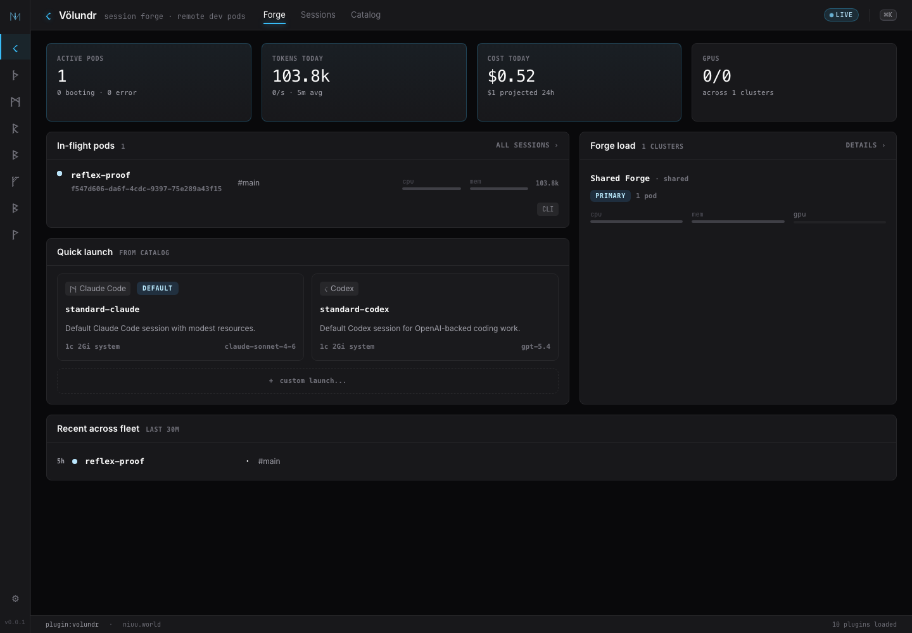
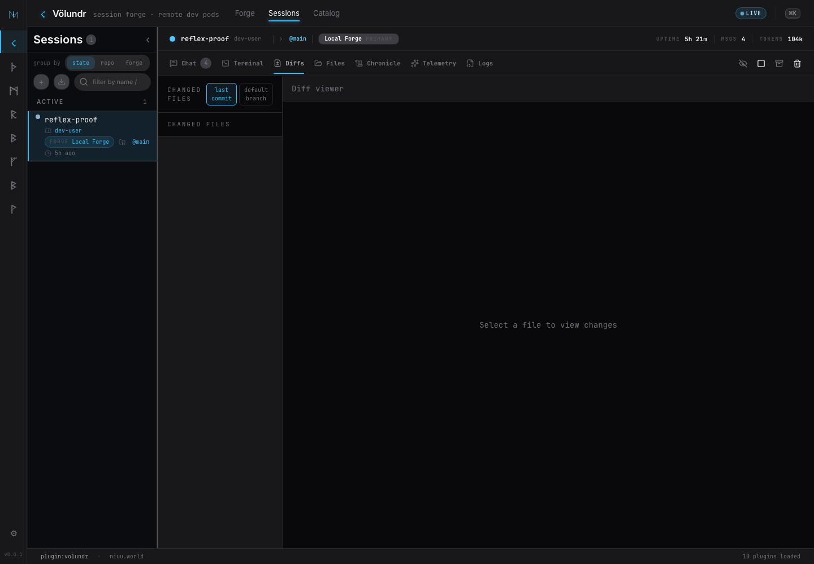
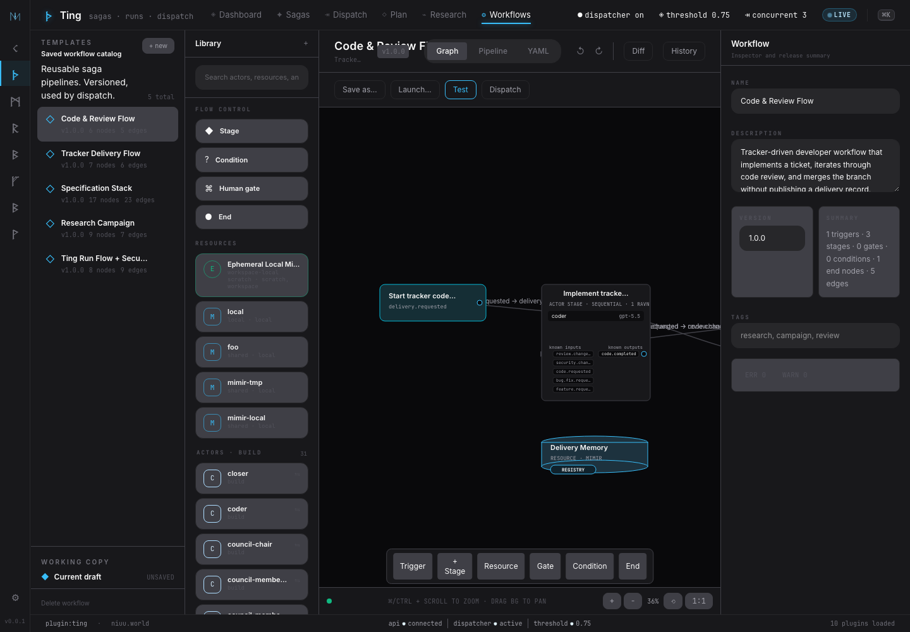
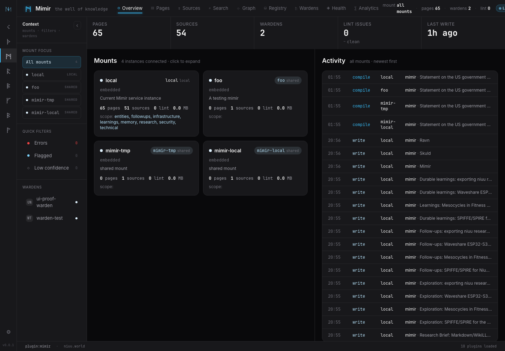
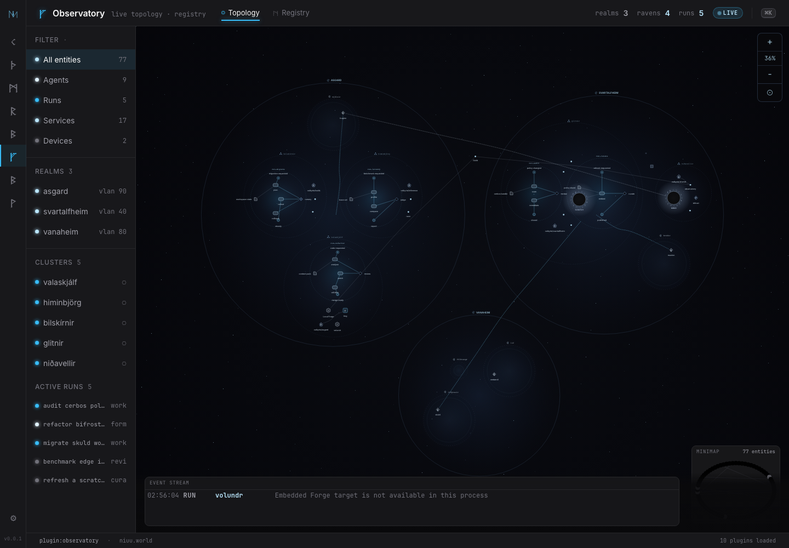

---
hide:
  - navigation
  - toc
---

<nav class="landing-nav" aria-label="Landing navigation">
  <a class="landing-brand" href="./" aria-label="Niuu home">
    
    Niuu
  </a>
  

    <a href="get-started/introduction/">Docs</a>
    <a href="https://github.com/niuulabs/volundr">GitHub</a>
    <a class="landing-nav-cta" href="get-started/install/">Get started</a>
  

</nav>

<section class="landing-hero" markdown>

Self-hosted AI operations

# Self-evolving agents on your platform.

Niuu is a self-hosted platform for AI workspaces, coordinated agent teams, always-on assistants, shared knowledge, and local or cloud model control. It includes its own agent harness and uses the same repos, terminals, tools, memory, and review surfaces humans do, while still bringing Codex, Claude, opencode, and other coding agents into the loop. Run it on a laptop while you experiment, slowly add additional machines if and when you need them, then take the same operating model to Kubernetes when the work needs a real platform.

  <a class="primary" href="get-started/install/">Get started</a>
  <a href="get-started/introduction/">Read the docs</a>
  <a href="https://github.com/niuulabs/volundr">View repository</a>

</section>

<section class="landing-gallery" aria-labelledby="gallery-title" markdown>

## See the platform in motion

A quick tour of the Niuu platform: workspaces, teams, memory, models, and observability.

<figure id="gallery-forge">
  
  <figcaption>
    <strong>Launch workspaces.</strong>
    Völundr turns repos, presets, and runtime targets into isolated AI workspaces.
  </figcaption>
</figure>

<figure id="gallery-session">
  
  <figcaption>
    <strong>Review the work.</strong>
    Sessions keep chat, terminal, files, chronicles, telemetry, logs, and diffs together.
  </figcaption>
</figure>

<figure id="gallery-workflows">
  
  <figcaption>
    <strong>Coordinate teams.</strong>
    Ting models reusable workflows, gates, resources, and multi-agent runs.
  </figcaption>
</figure>

<figure id="gallery-memory">
  
  <figcaption>
    <strong>Keep knowledge alive.</strong>
    Mímir gives operators and assistants a shared memory system with sources, mounts, and wardens.
  </figcaption>
</figure>

<figure id="gallery-models">
  
  <figcaption>
    <strong>Control model routing.</strong>
    Bifröst presents local and cloud model availability through one control plane.
  </figcaption>
</figure>

<figure id="gallery-topology">
  
  <figcaption>
    <strong>Watch the platform.</strong>
    Observatory shows live topology, services, agents, runs, and event flow.
  </figcaption>
</figure>

  <a href="#gallery-forge">Forge</a>
  <a href="#gallery-session">Review</a>
  <a href="#gallery-workflows">Workflows</a>
  <a href="#gallery-memory">Memory</a>
  <a href="#gallery-models">Models</a>
  <a href="#gallery-topology">Topology</a>

</section>

<section class="landing-steps" markdown>

## How it works

### 1. Run it where you work

Start the local stack for development or deploy the platform components to Kubernetes when you need shared infrastructure.

### 2. Launch an AI workspace

Create a session with a repo, preset, model, tools, workspace storage, and an operator-visible lifecycle.

### 3. Coordinate teams and workflows

Use Ting and Ravn to route work through specialists, gates, review loops, resident assistants, and human escalation.

### 4. Keep the knowledge

Capture chronicles, memory, research, sources, and long-lived assistant context so the platform learns from the work.

</section>

<section class="landing-platform" markdown>

## Platform map

Niuu is built as cooperating services rather than one opaque agent runner.

<strong>Völundr</strong>AI workspaces, session lifecycle, git review, and remote dev pods.

<strong>Ting</strong>Workflow orchestration, dispatch queues, stages, gates, and runs.

<strong>Ravn</strong>Personas, assistants, triggers, sessions, budgets, and resident behaviors.

<strong>Valkyries</strong>Resident Ravn personas that watch environments, make judgments, act within policy, and learn with their flock.

<strong>Mímir</strong>Shared knowledge, sources, search, wardens, and memory health.

<strong>Bifröst</strong>Model catalog, provider health, aliases, routing, and usage telemetry.

<strong>Guild</strong>Runtime registry for local and remote service instances.

<strong>Skuld</strong>Live session broker for chat, terminal, tools, and workspace events.

<strong>Observatory</strong>Topology, registry, service visibility, and live event context.

<strong>Sleipnir</strong>Transport layer across local processes, NATS, NNG, RabbitMQ, and more.

</section>

<section class="landing-faq" markdown>

## Frequently asked questions

  
Is Niuu self-hosted?

  
Yes. Niuu is designed to run on your machine, in your lab, or in your Kubernetes environment. You choose which services are local, shared, or remote.

  
Does work stay local?

  
The platform is self-hosted, but model traffic depends on the providers you configure. You can route to local models through Ollama-style providers or to cloud providers when your workflow allows it.

  
Can it run on Kubernetes?

  
Yes. The repository includes Helm charts for the Niuu umbrella deployment and individual services. The local stack is the quickest path for development.

  
What permissions do agents have?

  
Agents run inside the workspaces and infrastructure you configure. Treat those workspaces as powerful automation environments: scope credentials, review changes, and use the security docs before production use.

  
How mature is the project?

  
Niuu is under active development. The docs focus on what operators can run and reason about today, while deeper legacy material remains archived until it is rewritten around the current platform.

</section>

<section class="landing-final" aria-labelledby="landing-final-title">
  
Ready to run it yourself?

  <h2 id="landing-final-title">Build the stack where your agents work.</h2>
  
Start with the local development stack, then carry the same workspace, workflow, memory, and model-control pattern into shared infrastructure when the work grows up.

  

    <a class="primary" href="get-started/install/">Get started</a>
    <a href="concepts/platform-model/">Learn how it works</a>
  

</section>

<footer class="landing-footer">
  

    

      <strong>Niuu</strong>
      Self-hosted AI workspaces, teams, assistants, memory, and model operations.
    

    <nav aria-label="Docs footer navigation">
      <h2>[Resources]</h2>
      <a href="get-started/introduction/">Docs</a>
      <a href="get-started/install/">Install</a>
      <a href="reference/configuration/">Configuration</a>
      <a href="reference/api/">API</a>
    </nav>
    <nav aria-label="Platform footer navigation">
      <h2>[Platform]</h2>
      <a href="concepts/sessions-and-workspaces/">Workspaces</a>
      <a href="concepts/workflows-and-teams/">Workflows</a>
      <a href="concepts/memory-and-knowledge/">Memory</a>
      <a href="concepts/model-routing/">Model routing</a>
    </nav>
    <nav aria-label="Operations footer navigation">
      <h2>[Operations]</h2>
      <a href="operations/kubernetes-deployment/">Kubernetes</a>
      <a href="operations/production-checklist/">Production</a>
      <a href="operations/security-and-permissions/">Security</a>
      <a href="operations/observability/">Observability</a>
    </nav>
    <nav aria-label="Project footer navigation">
      <h2>[Project]</h2>
      <a href="https://github.com/niuulabs/volundr">GitHub</a>
      <a href="https://github.com/niuulabs/volundr/issues">Issues</a>
      <a href="troubleshooting/faq/">FAQ</a>
      <a href="troubleshooting/common-issues/">Common issues</a>
    </nav>
  

  

    © 2026 Niuu Labs
    <a href="https://github.com/niuulabs/volundr">niuulabs/volundr</a>
  

</footer>

