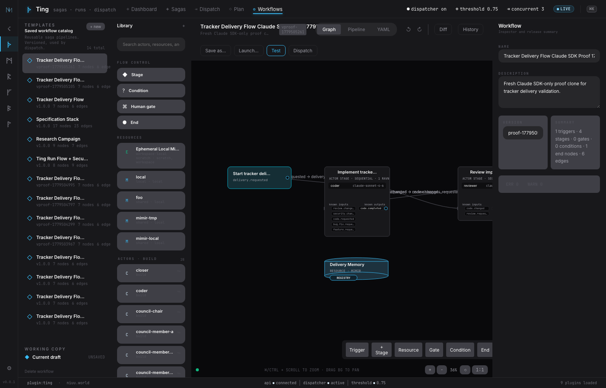
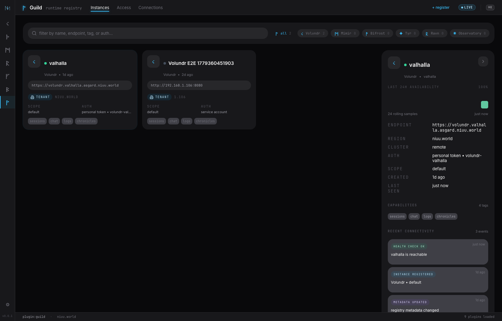
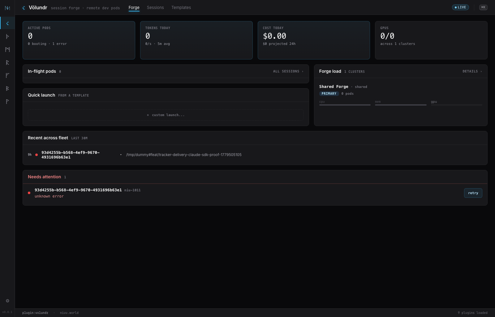
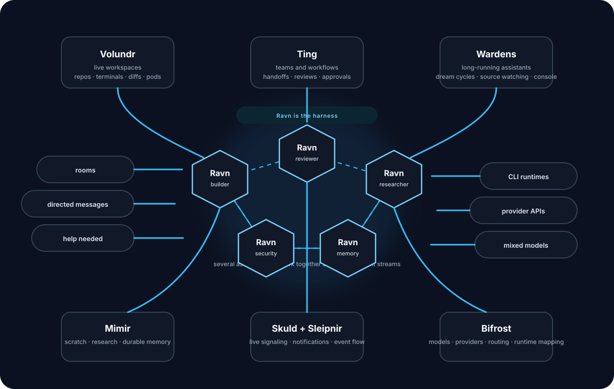

---
hide:
  - navigation
  - toc
---

{ .hero-logo width="84" }

# Niuu

The self-hosted platform for AI workspaces, custom AI teams, always-on assistants, shared knowledge, and local or cloud AI.

  AI workspaces
  Custom AI teams
  Always-on assistants
  Shared knowledge
  Local &amp; cloud AI
  Laptop to Kubernetes

  <a href="#what-niuu-is" class="primary">Start here</a>
  <a href="#platform-map" class="secondary">Platform map</a>
  <a href="https://github.com/niuulabs/volundr" class="secondary">Repository</a>

## What Niuu Is

Niuu brings four operating modes into one platform you can run on your own machine, on Kubernetes, or inside your own infrastructure:

- **AI workspaces** for hands-on work with one assistant or several assistants working together in a live coding environment
- **Custom AI teams** you can design, launch, and steer for coding, research, operations, and your own multi-step flows
- **Always-on assistants** that monitor sources, revisit knowledge, refresh documents, and stay available for live operator guidance
- **Local and cloud AI** managed in one place, including what models are available, where they run, and when they are used

The result is a self-hosted system where you can move smoothly between direct operator work, autonomous execution, durable memory, and local or third-party models without handing control to an external vendor platform.

## In the UI

  

  
  

## Why It Exists

### One platform, not disconnected tools

Workspaces, AI teams, assistants, and model routing all live in one system with shared auth, shared memory, shared events, and one operator experience.

### Operators stay in control

Humans can inspect, interrupt, redirect, approve, and steer the platform at every layer instead of treating agents like opaque background jobs.

### Memory is first-class

Shared knowledge is not an afterthought. It is where research, debate, durable documentation, and long-lived assistant curation all accumulate.

### Local and cloud AI from one place

Choose which models are available, whether work stays local or uses third-party providers, and how the rest of the platform can use them without every tool inventing its own rules.

## How Niuu Operates

{ .niuu-architecture-diagram }

- **Volundr** is where humans work directly.
- **Ting** coordinates specialist teams and review loops.
- **Ravn** is the harness for one assistant or a connected team of assistants.
- **Mimir** keeps shared memory alive.
- **Bifrost** decides what models are available and where they run.

## What Niuu Lets You Build

### Live AI workspaces

Launch and manage coding workspaces with repos, terminals, diffs, and live conversation with one assistant or several assistants working together.

### Build and run AI teams

Compose your own specialist teams for, for example, coding, review, security, research, approvals, retries, and whatever stage logic your process needs.

### Ravn is the harness

Use one runtime layer for personas, tools, triggers, human escalation, live comms, and long-lived assistants, while connecting to models through CLI transports or provider APIs.

### Shared knowledge

Store raw ingest, scratch discussion, curated memory, research outputs, postmortems, and Warden-maintained knowledge.

### Manage local and cloud AI

Decide which models are available, which providers back them, whether work stays local or goes to third parties, and how the rest of the platform chooses between them.

### Run assistants that stay alive

Run assistants that keep working after the interactive session ends: watching sources, refreshing stale documents, curating knowledge, running scheduled reflection, and staying reachable through a live operator console.

### Human guidance stays in the loop

Let assistants and teams raise help-needed events, send directed messages, pause for operator input, and resume without losing context.

## Operator Journeys

### 1. Pair directly with AI

Use a live workspace when you want a terminal, diffs, and a direct room with one assistant or several assistants working together while keeping everything on your own infrastructure.

### 2. Launch coordinated work

Use an AI team when the work should move across multiple specialists, approvals, reviews, or custom stages you define for your own process.

### 3. Keep knowledge alive

Use always-on assistants and shared knowledge when the work should keep happening after the workspace closes: source monitoring, document refresh, ongoing curation, scheduled reflection, and long-lived assistants you can still steer directly.
