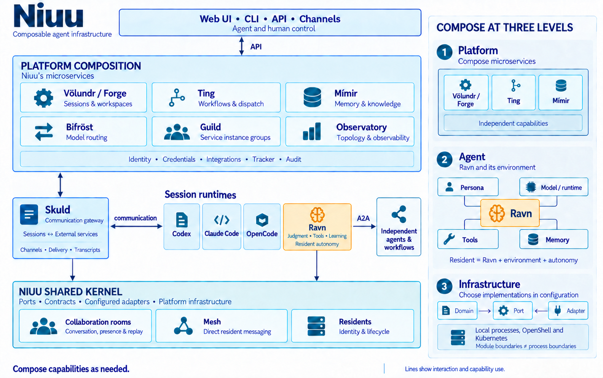
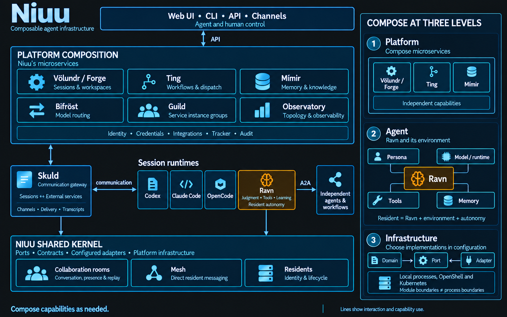

---
hide:
  - toc
---

Niuu documentation

# Build agent systems that collaborate, learn, and evolve.

Niuu is a composable platform for agent work: coding, research, operations, and
the processes that connect them. Bring together agent runtimes, coordinated
workflows, shared knowledge, and autonomous residents to build the system your
work needs.

People and agents can both operate that system. They can initiate work, use
services, participate in conversations, inspect results, and guide what happens
next through the platform's APIs and channels.

[Explore the architecture →](concepts/platform-model.md){ .md-button .md-button--primary }
[Try your first session](get-started/first-local-stack.md){ .md-button }

## Compose the way work happens

A coding task might need one agent and a workspace. Research might need several
specialists sharing evidence. An operational responsibility might need a resident
that keeps observing, follows through on decisions, and learns from the outcome.
Niuu provides the services and shared infrastructure to connect these forms of work.

- **Coordinate specialists**

    Give agents distinct roles, connect their work through workflows, and bring
    people into the decisions that need them. Use collaboration rooms for shared
    conversations and mesh for direct communication within a flock.

    [Workflows and collaboration →](concepts/workflows-and-teams.md)

- **Carry knowledge forward**

    Keep sources, evidence, and evolving understanding available beyond a single
    conversation. Give subsequent agents knowledge they can retrieve, examine,
    and revise through Mímir.

    [Shared memory and knowledge →](concepts/memory-and-knowledge.md)

- **Give an environment a resident**

    Configure a Ravn to steward an environment over time: observe what changes,
    decide when to act or ask for help, and maintain the context needed to continue.

    [Agents and residents →](concepts/agents-and-personas.md)

- **Choose and connect the parts**

    Combine runtime execution, model routing, workspaces, discovery, and
    observability. Use services independently or together, with local processes,
    OpenShell, and Kubernetes as deployment and execution options.

    [Choose your next step →](get-started/path-from-small-to-autonomous.md)

## Ravn brings judgment. Niuu connects the system.

Ravn is Niuu's agent runtime for reasoning, learning from outcomes, and evolving
capabilities. It can work directly with you, participate in a team, or run as an
autonomous resident. It owns the decisions about what to investigate, do, learn,
and revisit.

Niuu supplies the services those agents can use and the infrastructure that lets
them work together. Skuld connects runtime sessions to services and channels,
including sessions powered by Claude Code, Codex, and OpenCode. Shared Niuu
libraries provide collaboration rooms, mesh mechanics, and resident infrastructure.

{ .architecture-light }
{ .architecture-dark }

[See how the components fit together →](concepts/platform-model.md)

### Start with something you can verify

The quick start uses one coding session to introduce the platform: authenticate
a runtime, launch a workspace, and inspect a real result. From there, connect a
repository or explore workflows, knowledge, and residents according to your goals.

[Follow the quick start →](get-started/first-local-stack.md){ .md-button .md-button--primary }
[Work with a repository](get-started/configure-project.md){ .md-button }

## Find an exact answer

| I need… | Go to… |
| --- | --- |
| Commands and flags | [Niuu CLI](reference/cli-niuu.md) · [Ravn CLI](reference/cli-ravn.md) |
| Configuration files and overrides | [Configuration](reference/configuration.md) |
| HTTP routes and request schemas | [API reference](reference/api.md) |
| Provider login and session credentials | [Credentials and secrets](reference/credentials-and-secrets.md) |
| Help with a failed launch | [Troubleshooting](troubleshooting/common-issues.md) |
| Evidence that the quick start works | [Verification record](operations/quickstart-verification.md) |

